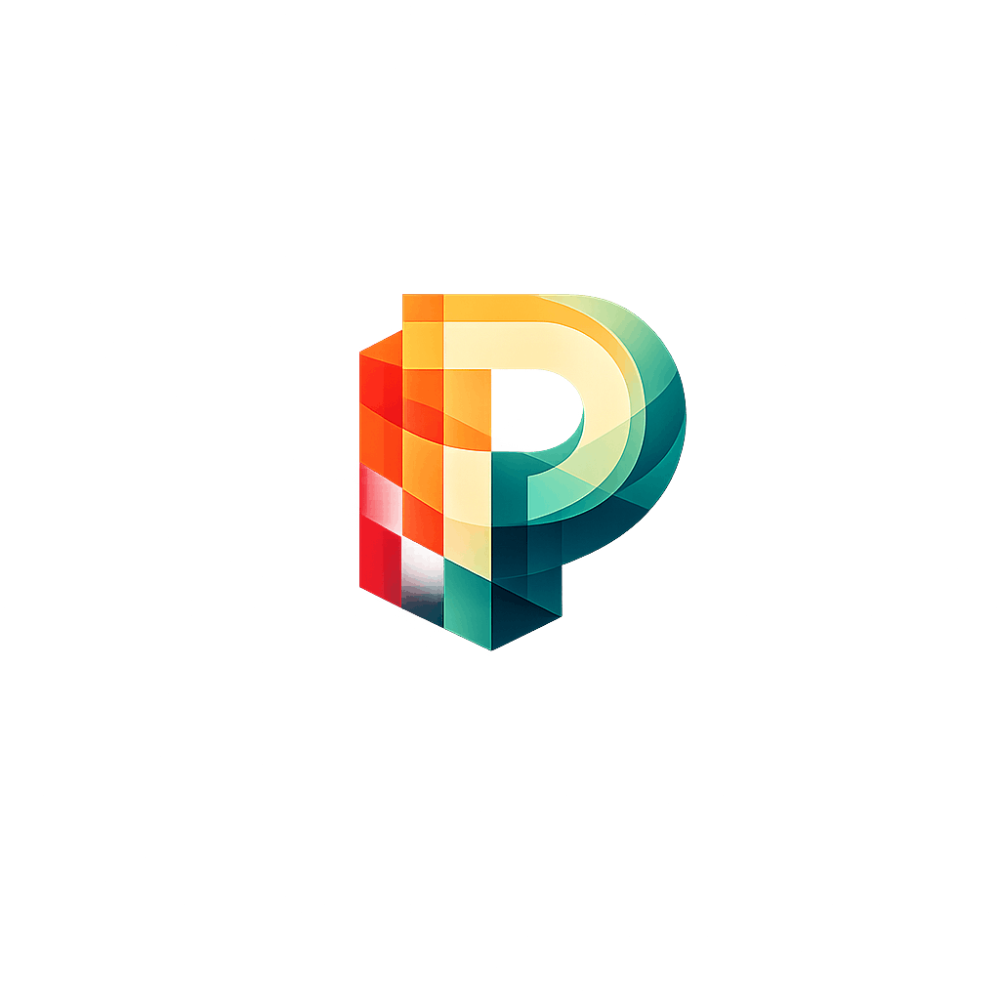
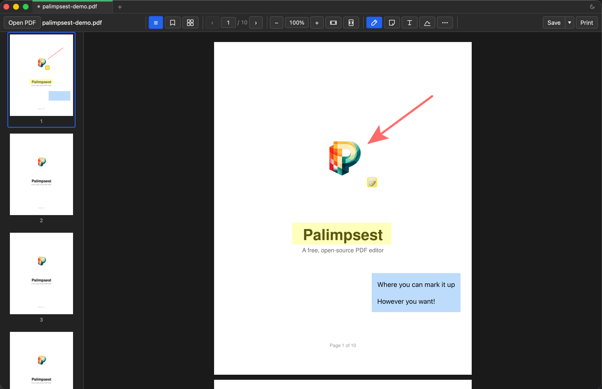

<p align="center">
  
</p>

<h1 align="center">Palimpsest</h1>

<p align="center">
  A free, open-source PDF editor for people who just want to get things done.
</p>

<p align="center">
  <a href="./LICENSE"></a>
  
  <a href="../../releases/latest"></a>
</p>

---

<p align="center">
  
</p>

A [palimpsest](https://en.wikipedia.org/wiki/Palimpsest) is a manuscript where older writing has been scraped away and written over — but traces of earlier layers still show through. That's exactly what came to mind when I was thinking about the way I use PDFs: with plenty of annotations which live alongside a project =]

Palimpsest lets you view, annotate, and organize PDFs entirely on your machine. No account, no subscription, no cloud upload. Open a file, highlight some text, drop a note, sign it, save. Everything is written directly into the PDF using standard annotation formats that any reader can display.

## Download

Grab the latest build for your platform from the [Releases](../../releases/latest) page:

| Platform | File |
|----------|------|
| macOS (Intel & Apple Silicon) | `.dmg` |
| Windows | `.msi` |
| Linux | `.deb` / `.AppImage` |

## What you can do

**Annotate freely** — highlights (7 colors), sticky notes, text boxes with full formatting (bold/italic/underline, fonts, colors), freehand drawing, shapes (rectangles, ellipses, lines, arrows), underline, strikethrough. Everything is draggable, resizable, and undo/redo-able.

**Sign documents** — draw a signature or type one in a cursive font. Signatures are saved locally for reuse. `Save Flattened` bakes everything permanently into the page so annotations can't be removed.

**Organize your doc** — drag-and-drop reorder in the sidebar or gallery view. Delete, rotate, extract, split, insert blank pages, or insert images as pages. Merge multiple PDFs into one.

**Redact securely** — mark areas for redaction, then apply to permanently and irreversibly cover content with black.

**Read comfortably** — continuous scroll with lazy rendering, pinch-to-zoom, text search, bookmarks, multi-tab, dark mode, and keyboard shortcuts for everything.

<details>
<summary><strong>Full feature list</strong></summary>

### Viewing & Navigation
- Continuous scroll with lazy page rendering and pinch-to-zoom (10%–10,000%)
- Multi-tab — open multiple PDFs in tabs
- Thumbnail sidebar and gallery view with drag-and-drop page reorder
- Text search with match navigation (Cmd/Ctrl+F)
- Fit Width / Fit Page zoom presets
- Drag-and-drop file open
- Text selection with copy support
- Custom bookmarks with unified sidebar (user bookmarks + built-in document outline)

### Annotations
- Highlights — drag to create, 7-color palette, resize handles, recolor via right-click
- Text boxes — click to place, inline formatting (bold/italic/underline, font size/family, text color, background color)
- Sticky notes — click to place, editable popover, drag to reposition
- Shapes — rectangle, ellipse, line, arrow with resize handles and configurable stroke width
- Underline & strikethrough — drag to create, recolor via right-click
- Freehand ink drawing — multi-stroke, configurable stroke width
- Signatures & initials — draw or type (3 cursive fonts), saved locally for reuse
- All annotations are draggable and resizable after placement
- Undo / Redo (Cmd/Ctrl+Z / Cmd/Ctrl+Shift+Z)
- Annotations are saved directly into the PDF

### Page Management
- Reorder pages via drag-and-drop in sidebar, gallery, or context menu
- Delete, rotate, extract, or split pages
- Multi-select in gallery with bulk actions (extract, rotate, delete)
- Insert blank pages or images as new pages
- Merge multiple PDFs into one

### Security
- Redaction — mark areas, then apply to permanently cover content with black

### Saving & Export
- Save, Save As, Save Flattened (permanently bakes annotations into non-editable page content)
- Export as images (PNG/JPEG with quality and scale options)
- Print via native OS dialog

</details>

## Why Palimpsest?

**vs. paid PDF editors** — The big names charge $150–250/year and require an account. Palimpsest is free, runs offline, and never phones home.

**vs. built-in viewers** — Tools like Preview and Evince are fantastic for reading, but a little limited for annotation. Palimpsest writes standard PDF annotations that any reader can display; plus offers shapes, text boxes, freehand drawing, signatures, redaction, and page management.

**vs. web-based editors** — Your documents never leave your machine. No upload, no conversion, no file size limits.

## Development

**Prerequisites:** Node.js 22+, Rust stable, and [Tauri v2 system dependencies](https://v2.tauri.app/start/prerequisites/).

```sh
npm install       # install dependencies
make run          # dev mode with hot reload
make check        # type-check frontend + backend
make test         # run all 108 tests
make build        # production build
```

### Cutting a release

```sh
make release VERSION=1.0.0
```

Bumps the version in `package.json` and `Cargo.toml`, commits, tags, and pushes. GitHub Actions builds binaries for all platforms.

## Tech Stack

- **Frontend:** React 19, TypeScript, Vite
- **Desktop:** Tauri 2
- **PDF rendering:** MuPDF WASM (default) or PDF.js — switchable at runtime
- **PDF manipulation:** lopdf (Rust)
- **Testing:** Vitest + React Testing Library, cargo test

## License

Licensed under [AGPL-3.0](./LICENSE) 

Palimpsest will always be free and open source, and so will any fork or modified version. There's no telemetry, no analytics, no tracking, and no artificial limits. You download it, you use it, and that's the whole relationship.

Good software doesn't need to extract value from the people who use it.

## Author

Built by [Alex Gelinas](https://github.com/bassman2112).

<sub>And yes, Palimpsest is also a [Protest the Hero](https://www.youtube.com/watch?v=OXyb5tDR8RA) reference.</sub>
